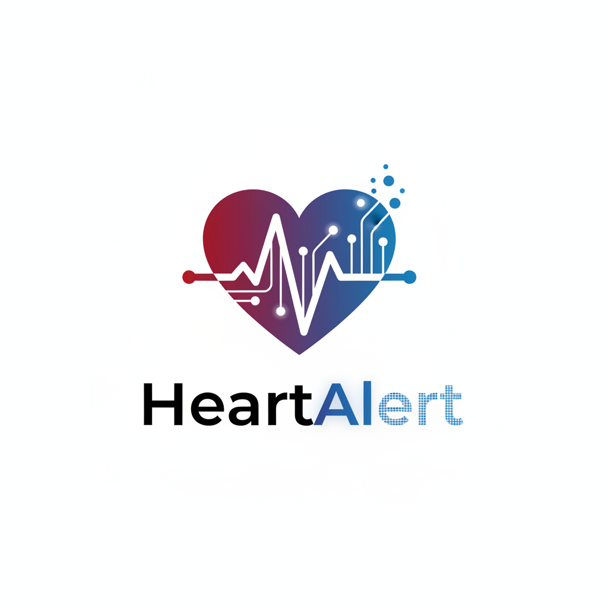

# Heart Disease Prediction System

**AI-Powered Early Risk Assessment with Personalized Health Guidance**

An AI-driven healthcare decision-support application designed to help users assess heart disease risk in seconds and receive personalized, explainable health recommendations through a conversational AI assistant.

This project combines machine learning, AI interaction, and report generation to address a real-world healthcare problem: delayed and inaccessible early screening.

---

## 🚩 The Problem

Heart disease is one of the leading causes of death worldwide, yet many cases are preventable with early detection.

### The challenges:
- Traditional risk assessments take time
- Doctors are overloaded
- Patients wait days for clarity
- Medical reports are hard to understand
- Early signals are often missed when action could still prevent severe outcomes

---

## 💡 What This System Does

This application provides:

- **Instant heart disease risk prediction** in under 30 seconds
- **Personalized health recommendations** powered by an AI assistant
- **Continuous chat support** to explain medical concepts in plain language
- **Downloadable PDF health reports** with unique Report IDs for reference or doctor visits

It is built as a **decision-support tool**, not a replacement for medical professionals.

---

## 🎯 Solution Overview

The system integrates three core components:

1. **Machine Learning Risk Prediction**
2. **AI Health Assistant for Personalized Guidance**
3. **User-Friendly Web Application with Report Generation**

Users receive not just a prediction, but context, explanation, and next-step guidance.

---

## 🧠 Machine Learning Approach

- **Dataset**: 918 patient health records
- **Extensive preprocessing**:
  - Missing value handling
  - Outlier treatment
  - Feature scaling using StandardScaler
- **Models evaluated**: 5 machine learning algorithms
- **Final model selected**: K-Nearest Neighbors (KNN)

### Model Performance

| Metric | Score |
|--------|-------|
| **Accuracy** | 88.6% |
| **Improvement over baseline** | 19% |

The model prioritizes reliability for high-risk cases, minimizing false negatives.

---

## 🤖 AI Health Assistant (Key Feature)

After prediction, users can interactively chat with an AI health assistant.

### The assistant allows users to ask:
- "What does high cholesterol mean?"
- "How can I lower my blood pressure?"
- "Should I consult a cardiologist?"

### The AI provides:
- Personalized recommendations
- Plain-English explanations
- Context-aware responses based on model output

This transforms a static ML prediction into a **guided health experience**.

---

## 📄 PDF Reports with Report ID

Each prediction generates:

- A **unique Report ID**
- A **downloadable PDF report** containing:
  - Input summary
  - Risk assessment
  - Key contributing factors
  - Personalized recommendations

### These reports can be:
- Saved for personal tracking
- Shared with healthcare professionals
- Used for follow-up discussions

---

## 🖥️ Application Interface

- Built with **Streamlit**
- Simple, non-technical UI
- Designed for:
  - General users
  - Students
  - Early health awareness

Results are delivered in seconds, not days.

---

## 🛠️ Tech Stack

### Machine Learning
- Python
- Scikit-learn
- KNN

### Data Processing
- Pandas
- NumPy

### AI Assistant
- Together AI (LLaMA-based conversational model)

### Deployment
- Streamlit

---

## 📁 Repository Structure



```
Heart-Stroke-Prediction/
│
├── app.py
├── HeartProjectLogo.png
├── HeartdiseaseFinal.ipynb
├── KNN_heart.pkl
├── README.md
├── columns.pkl
├── heart.csv
├── requirements.txt
└── scaler.pkl
```

---

## 🚀 Getting Started

### Prerequisites
- Python 3.8+
- pip

### Installation

1. Clone the repository
```bash
git clone https://github.com/the-noble-analyst/Heart-Stroke-Prediction.git
cd Heart-Stroke-Prediction
```

2. Install dependencies
```bash
pip install -r requirements.txt
```

3. Run the application
```bash
streamlit run app.py
```

4. Open your browser and navigate to the local URL (typically `http://localhost:8501`)

---

## ⚠️ Medical Disclaimer

**This application is intended for educational and decision-support purposes only.**  
It does not replace professional medical diagnosis or treatment.

---

## 📊 Key Numbers

- **88.6%** accuracy
- **< 30 seconds** for results
- **24/7** AI assistant availability
- **5** ML algorithms tested
- **918** patient records processed

---

## 💙 Why This Matters

This project is about **early awareness and accessibility**, not replacing doctors.

### It helps:
- Individuals understand risk earlier
- Clinics prioritize urgent cases
- Patients have informed conversations with doctors

If it helps even one person catch a problem early, it's worth it.

---

## ✅ Key Takeaway

This project demonstrates how machine learning, conversational AI, and product thinking can come together to create a real, human-centered healthcare solution.

---

## 🔗 Links

- **GitHub Repository**: [https://github.com/the-noble-analyst/Heart-Stroke-Prediction](https://github.com/the-noble-analyst/Heart-Stroke-Prediction)
- **Live Application**: [https://heart-stroke-prediction-nabeels.streamlit.app/](https://heart-stroke-prediction-nabeels.streamlit.app/)


---

## 🔮 Future Enhancements

- Integration with wearable health devices
- Multi-language support
- Mobile application version
- Enhanced visualization of risk factors
- Historical tracking for registered users
- Integration with electronic health records (EHR)
- Advanced risk factor analysis with trend prediction

---

## 🤝 Contributing

Contributions, issues, and feature requests are welcome! 


## 👤 Author

**Nabeel**
- GitHub: [@the-noble-analyst](https://github.com/the-noble-analyst)
- Project Link: [Heart Stroke Prediction](https://github.com/the-noble-analyst/Heart-Stroke-Prediction)

---

## 📞 Support

If you have any questions or need help with the project, please open an issue or reach out through wmail : nabeelsiddiqui468@gmail.com

---

⭐️ **If you found this project helpful, please consider giving it a star!**

---

*Built with ❤️ for better health awareness*
